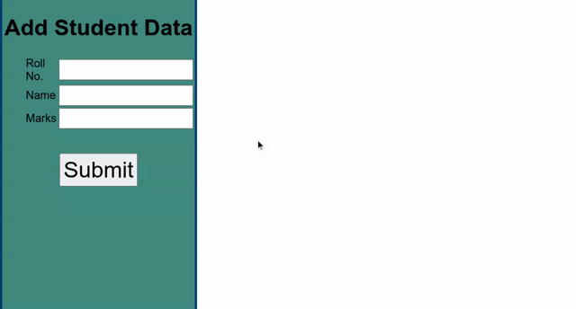

# Student Data Viewer

Takes the data from form inputs and then render it as rows

[See Live Version](https://yuganksingh.github.io/record-student-data/)

# What I learned
- Using JQuery to take input
- Using JQuery to manipulate DOM
- working with JQuery DOM objects
- usign Media Queries
